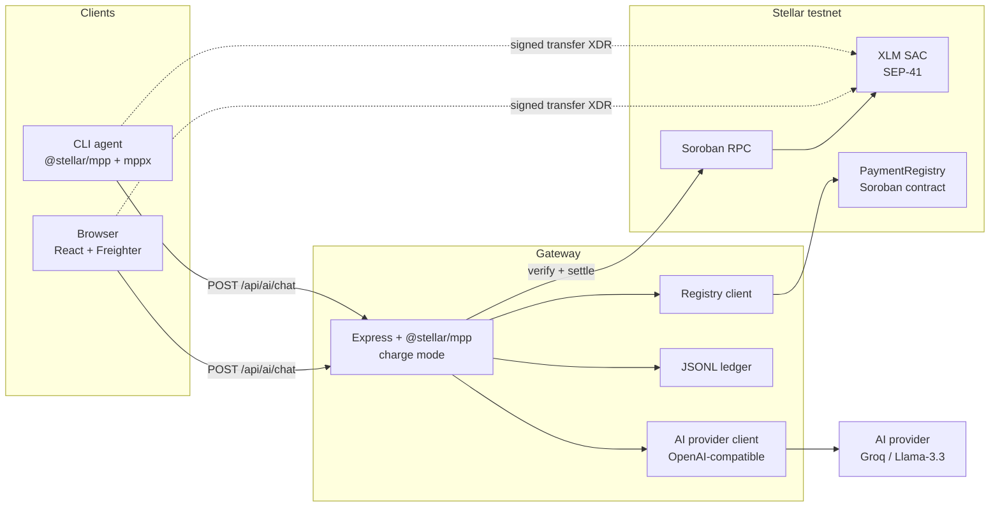
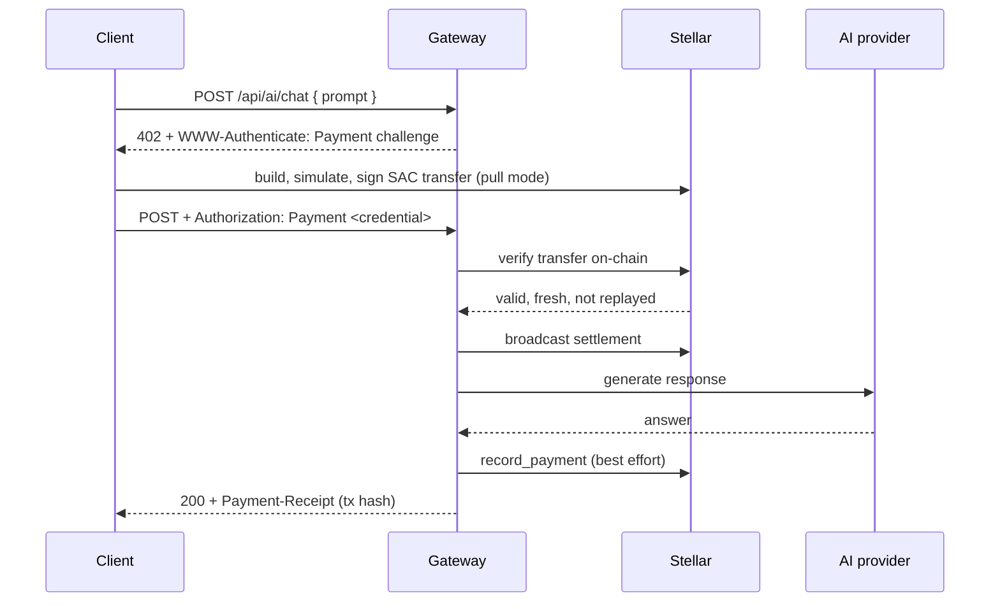

# AgentPay

An AI agent payment gateway on Stellar testnet. The gateway answers a prompt
only after the caller settles a micro-payment in native XLM, using the
Machine Payments Protocol (MPP) - the payment layer behind the
[x402](https://paymentauth.org) standard. Payments settle through the XLM
Stellar Asset Contract (SEP-41) and are recorded on a Soroban contract.

The project demonstrates the full stack: a Rust Soroban contract, a
wire-compatible x402/MPP server and client, a hand-rolled browser MPP client,
Freighter wallet integration, and a real LLM (Llama-3.3-70B via Groq) behind
the paywall.

## Architecture

The system is a pay-per-prompt service: clients must pay in XLM before the
gateway serves an AI answer. Three layers cooperate: a **client** (browser or
CLI agent), the **gateway** (`server/`), and **Stellar testnet** (the XLM SAC
token contract, Soroban RPC, and the PaymentRegistry Soroban contract).

### System overview



### Payment sequence



### Components

| Component | What it does |
|---|---|
| `contract/` | Rust Soroban contract (`PaymentRegistry`): admin-gated on-chain payment history with events and instance TTL management |
| `server/` | Express gateway: issues 402 challenges, verifies and settles SEP-41 transfers via `@stellar/mpp` charge mode, calls the AI provider, records payments |
| `web/` | React + Vite app with a dependency-free browser MPP client and Freighter integration |

## Live artifacts (testnet, protocol 27)

| Item | Value |
|---|---|
| PaymentRegistry contract | [CAPBFYMAEKG6GT2ZAMEEGDJAFMDRSBTYRYIA4PQUSDXCBL2DD7AWGKQJ](https://stellar.expert/explorer/testnet/contract/CAPBFYMAEKG6GT2ZAMEEGDJAFMDRSBTYRYIA4PQUSDXCBL2DD7AWGKQJ) |
| Gateway recipient | `GC5V36K6XI6EG5BDYMBDXHL5WFUPF3ZKTNMVMBM356B2TXIVZ2THALF6` |
| Demo agent (payer) | `GC5RTSKTBZ7NG437UHAFGAUHQ5JEZKPYPJZRW6JDMD6V2V6SYYT6M6J6` |
| Example payment (real AI) | [5fd2d7d7...d9a4a](https://stellar.expert/explorer/testnet/tx/5fd2d7d77b4f4fd1d19aee7780442b21b485dba5181725b3fa7627b3f31d9a4a) |
| Price per request | 0.05 XLM |

## Repository layout

```
contract/                Soroban contract (Rust, soroban-sdk 27)
  src/lib.rs             PaymentRegistry implementation + unit tests
  release/               Deployed wasm artifact
server/                  Gateway backend
  src/index.js           Express app, MPP paywall, routes
  src/config.js          Environment configuration
  src/ai.js              OpenAI-compatible provider client
  src/ledger.js          JSONL payment ledger
  src/registry.js        On-chain recording client (contract calls)
  src/cli-agent.js       Demo agent using the official MPP client stack
  setup-testnet.mjs      One-shot testnet bootstrap (self-contained, no CLI needed)
web/                     React + Vite frontend
  src/App.jsx            Chat UI, payment stepper, wallet controls
  src/lib/paywall.js     Browser MPP client (wire format, no SDK)
  src/lib/stellar.js     Freighter + Stellar SDK helpers
  src/components/        SVG icons, markdown renderer
docs/                    Protocol, architecture, troubleshooting
```

`stellar-cli.exe` is used only if you rebuild the contract from source; the
setup and gateway run without it.

## How a request is paid for

1. The client POSTs a prompt to `/api/ai/chat`.
2. The gateway replies `402 Payment Required` with a
   `WWW-Authenticate: Payment ...` challenge containing the amount (base
   units), currency (XLM SAC contract id), recipient, and expiry.
3. The client builds a SEP-41 `transfer` on the XLM SAC contract, simulates it
   against testnet RPC, and signs the envelope - with Freighter in the browser
   or a keypair in the CLI agent. This is pull mode: the payer never hands over
   a secret; the signed XDR is the credential.
4. The client retries with `Authorization: Payment <base64url credential>`.
   The gateway verifies the transfer on-chain (amount, recipient, currency,
   freshness, replay protection), broadcasts it, and only then calls the AI
   provider.
5. The response is returned with a `Payment-Receipt` header carrying the
   transaction hash. The payment is appended to the JSONL ledger and recorded
   on the PaymentRegistry contract (best effort).

See `docs/PROTOCOL.md` for the exact wire format.

## Prerequisites

- Node.js >= 22
- Rust toolchain (only needed to rebuild the contract)
- [Freighter](https://freighter.app) wallet for the browser demo

The Stellar CLI is only needed to rebuild the contract from source
(`cd contract && ../stellar-cli.exe contract build`). The one-shot setup and
the running gateway are fully self-contained - they use the committed wasm
and the Stellar SDK, so no global install is required.

## Quick start

### 1. Bootstrap testnet

```bash
cd server
npm install
npm run setup
```

`setup-testnet.mjs` generates and friendbot-funds two identities
(`agentpay-gateway`, `agentpay-agent`), deploys the PaymentRegistry contract,
and writes `server/.env`.

### 2. Run the gateway

```bash
cd server
npm start
```

The gateway listens on `http://localhost:4000`.

### 3a. Pay from the CLI agent

```bash
cd server
npm run agent -- "Why build on Stellar?"
```

The agent hits the 402, signs the transfer, and prints the response plus the
transaction hash.

### 3b. Pay from the browser

```bash
cd web
npm install
npm run dev
```

Open `http://localhost:5173`. Connect Freighter (testnet), fund the wallet if
the balance is below 1 XLM, then send a prompt and approve the transfer.

### Headless client test

`server/browser-client-test.mjs` reproduces the browser client code path in
Node against the live gateway:

```bash
cd server
node browser-client-test.mjs "your prompt"
```

## Configuration

All configuration lives in `server/.env`, written by `npm run setup`. A
commented template with every variable is kept at `server/.env.example`.

| Variable | Purpose |
|---|---|
| `STELLAR_RECIPIENT` | Address that receives payments |
| `STELLAR_SECRET_KEY` | Recipient secret, used only to record payments on-chain |
| `AGENT_SECRET_KEY` | Keypair the CLI demo agent pays from |
| `CONTRACT_ID` | Deployed PaymentRegistry contract id |
| `MPP_SECRET_KEY` | HMAC secret that binds MPP challenge ids |
| `AI_PROVIDER` | `mock` or `openai` (OpenAI-compatible endpoint) |
| `OPENAI_API_KEY` / `GROQ_API_KEY` | Provider key |
| `OPENAI_BASE_URL` | Provider base URL, e.g. `https://api.groq.com/openai/v1` |
| `OPENAI_MODEL` | Model id, e.g. `llama-3.3-70b-versatile` |
| `OPENAI_MAX_TOKENS` | Default 300 |
| `OPENAI_TEMPERATURE` | Default 0.7 |
| `PRICE_XLM` | Per-request price, default `0.05` |
| `PORT` | Default 4000 |
| `CORS_ORIGIN` | Default `http://localhost:5173` |

### AI provider

The gateway calls any OpenAI-compatible `/chat/completions` endpoint. The
default configuration targets Groq's free tier:

```bash
AI_PROVIDER=openai
OPENAI_API_KEY=gsk_...            # from console.groq.com, no credit card
OPENAI_BASE_URL=https://api.groq.com/openai/v1
OPENAI_MODEL=llama-3.3-70b-versatile
```

Notes:

- A key in `server/.env` takes precedence over a key already exported in the
  shell environment. The gateway deliberately re-reads `.env` for the AI key.
- With `AI_PROVIDER=openai` but a missing or placeholder key, the gateway
  serves the mock fallback and logs a warning, so the demo keeps working.
- `GET /api/health` reports `aiMode` (`openai`, `openai-mock-fallback`,
  `mock`), `aiModel`, and `aiKeyConfigured`.

## API

| Endpoint | Method | Description |
|---|---|---|
| `/api/health` | GET | Service status, recipient, price, AI mode, volume |
| `/api/payments` | GET | Recent recorded payments (from the JSONL ledger) |
| `/api/ai/chat` | POST | Paywalled AI endpoint; `{ prompt: string }` |

`/api/ai/chat` responses:

- `402` plus `WWW-Authenticate` challenge when no valid credential is attached
- `200` with `{ ok, response, payment: { requestId, amountXlm, txHash, explorerUrl } }`
  once the payment is verified and the response generated
- `400` when the prompt is missing; `500` with an `error` message on failure

## The smart contract

`contract/src/lib.rs` implements `PaymentRegistry` (soroban-sdk 27):

- `__constructor(admin)` - sets the gateway operator
- `record_payment(payer, amount, request_id)` - admin-only; rejects non-positive
  amounts; emits a `PaymentRecorded` event; maintains `Payments`, `Count`, and
  `TotalVolume` in instance storage
- `payment_count()`, `total_volume()`, `payments()`, `payment(index)` - reads

Instance storage TTL is re-extended past a 30-day threshold to ~120 days on
every write. The deployed wasm is preserved at `contract/release/`.

Rebuild and inspect:

```bash
cd contract
../stellar-cli.exe contract build
cargo test     # unit tests (non-Windows-GNU toolchains)

../stellar-cli.exe contract invoke \
  --id CAPBFYMAEKG6GT2ZAMEEGDJAFMDRSBTYRYIA4PQUSDXCBL2DD7AWGKQJ \
  --source-account agentpay-gateway -- payment_count
```

## What this demonstrates

- Soroban contract authoring, deployment, and on-chain state management
- x402/MPP protocol implementation on both server and client
- SEP-41 token transfers with pull-mode (client-signed) credentials
- Freighter wallet integration in a browser
- A real LLM served behind a per-request paywall
- End-to-end verification: 402 challenge, on-chain settlement, payment
  receipt, and contract-recorded history

## Documentation

- [docs/PROTOCOL.md](docs/PROTOCOL.md) - x402/MPP wire format and verification
- [docs/ARCHITECTURE.md](docs/ARCHITECTURE.md) - component design and security model
- [docs/TROUBLESHOOTING.md](docs/TROUBLESHOOTING.md) - common issues and fixes
